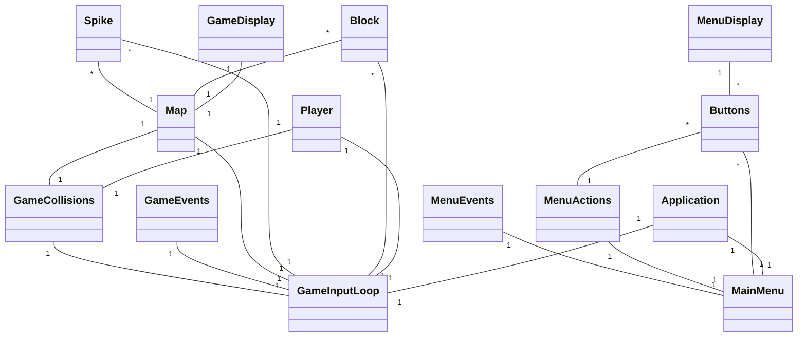
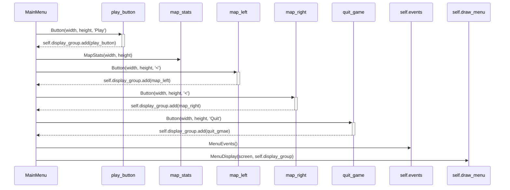

```mermaid
 classDiagram
      Application "1" -- "1" GameInputLoop 
      Application "1" -- "1" MainMenu
      Player "1" -- "1" GameInputLoop
      Block "*" -- "1" GameInputLoop
      Spike "*" -- "1" GameInputLoop
      Map "1" -- "1" GameInputLoop
      GameEvents "1" -- "1" GameInputLoop
      GameDisplay "1" -- "1" Map
      GameCollisions "1" -- "1" GameInputLoop
      Player "1" -- "1" GameCollisions
      Block "*" -- "1" Map
      Spike "*" -- "1" Map
      Map "1" -- "1" GameCollisions
      
      Buttons "*" -- "1" MainMenu
      Buttons "*" -- "1" MenuActions
      MenuActions "1" -- "1" MainMenu
      MenuDisplay "1" -- "*" Buttons
      MenuEvents "1" -- "1" MainMenu
      
```

### Päävalikon luominen

```mermaid
sequenceDiagram
    MainMenu->>+play_button: Button(width, height, 'Play')
    play_button -->>- MainMenu: self.display_group.add(play_button)
    MainMenu->>map_stats: MapStats(width, height)
    MainMenu->>+map_left: Button(width, height, '<')
    map_left -->>- MainMenu: self.display_group.add(map_left)
    MainMenu->>+map_right: Button(width, height, '<')
    map_right -->>- MainMenu: self.display_group.add(map_right)
    MainMenu->>+quit_game: Button(width, height, 'Quit')
    quit_game -->>- MainMenu: self.display_group.add(quit_gmae)
    MainMenu->>self.events: MenuEvents() 
    MainMenu->>self.draw_menu: MenuDisplay(screen, self.display_group)
```
