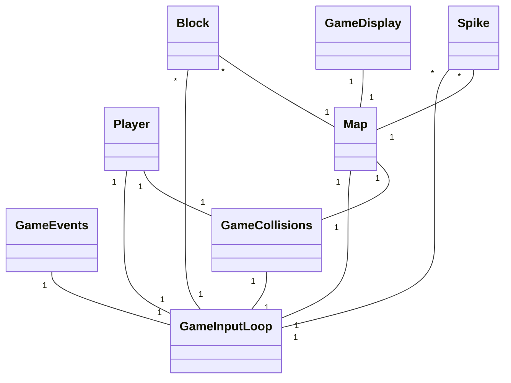
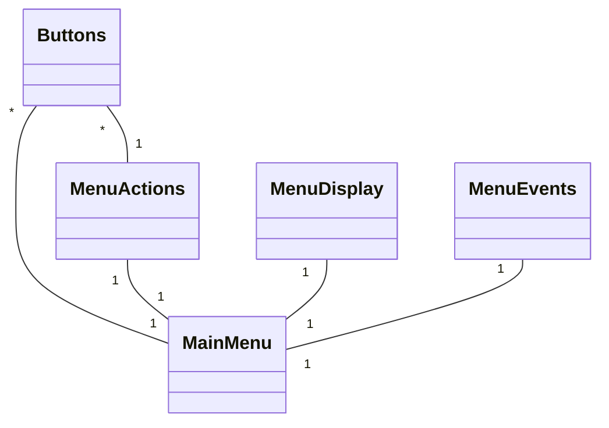

```mermaid
 classDiagram
      Player "1" -- "1" GameInputLoop
      Block "*" -- "1" GameInputLoop
      Spike "*" -- "1" GameInputLoop
      Map "1" -- "1" GameInputLoop
      GameEvents "1" -- "1" GameInputLoop
      GameDisplay "1" -- "1" Map
      GameCollisions "1" -- "1" GameInputLoop
      Player "1" -- "1" GameCollisions
      Block "*" -- "1" Map
      Spike "*" -- "1" Map
      Map "1" -- "1" GameCollisions
```

```mermaid
 classDiagram
      Buttons "*" -- "1" MainMenu
      Buttons "*" -- "1" MenuActions
      MenuActions "1" -- "1" MainMenu
      MenuDisplay "1" -- "1" MainMenu
      MenuEvents "1" -- "1" MainMenu
      
```
