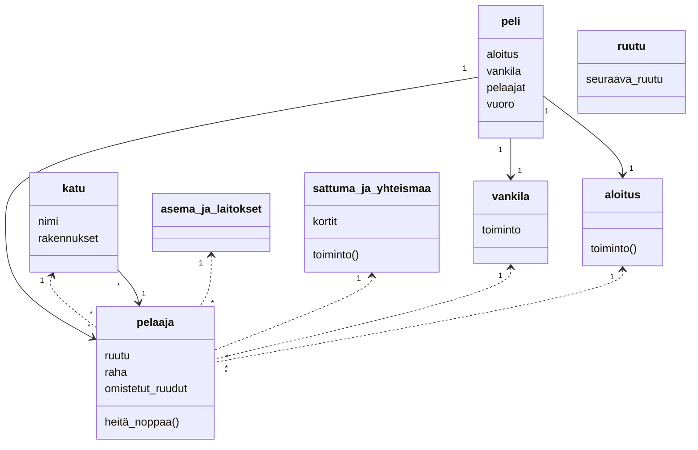

```mermaid
 classDiagram
      peli "1" --> "*" pelaaja
      peli "1" --> "1" aloitus
      peli "1" --> "1" vankila
      katu "1" <.. "*" pelaaja
      katu "*" --> "1" pelaaja
      asema_ja_laitokset "1" <.. "*" pelaaja
      sattuma_ja_yhteismaa "1" <.. "*" pelaaja
      vankila "1" <.. "*" pelaaja
      aloitus "1" <.. "*" pelaaja
      class pelaaja{
          ruutu
          raha
          omistetut_ruudut
          heitä_noppaa()
      }
      class peli{
          aloitus
          vankila
          pelaajat
          vuoro
      }
      class ruutu{
          seuraava_ruutu
      }
      class aloitus{
          toiminto()
      }
      class vankila{
          toiminto
      }
      class sattuma_ja_yhteismaa{
          kortit
          toiminto()
      }
      class asema_ja_laitokset{
      }
      class katu{
          nimi
          rakennukset
      }
```
