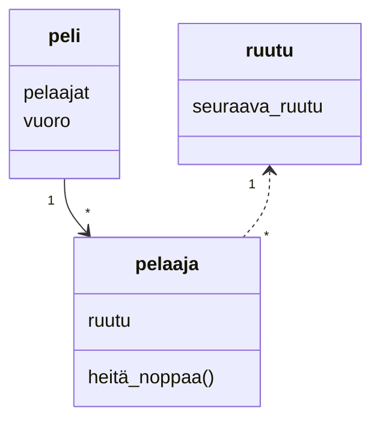

```mermaid
 classDiagram
      peli "1" --> "*" pelaaja
      ruutu "1" <.. "*" pelaaja
      class pelaaja{
          ruutu
          heitä_noppaa()
      }
      class peli{
          pelaajat
          vuoro
      }
      class ruutu{
          seuraava_ruutu
      }
```
